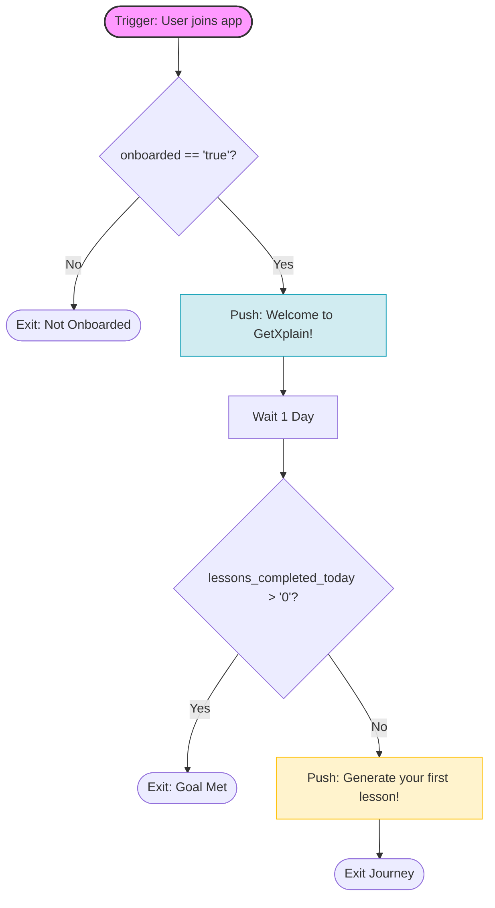

# Welcome journey — GetXplain (Mermaid-aligned Customer.io spec)

This document is the build source of truth for the visual campaign/workflow builder. Logic matches the diagram below node-for-node. Profile attributes used in conditions are stored as **strings** in the database; use **string literals** in equality checks (for example `onboarded` equals `"true"`). For numeric comparisons such as “greater than zero,” prefer the builder’s **numeric** “greater than” on `lessons_completed_today` if your workspace evaluates it correctly; otherwise see the note under `CheckAction`.

---

## Diagram (Mermaid)

---

## Campaign trigger

| Setting | Value |
|--------|--------|
| **Type** | Triggered campaign / journey (workflow). |
| **Trigger** | When the user **joins the app** (first-time join or account creation—use the event your product already sends for that moment). |
| **Event name** | **Not** defined by the profile-attribute Source of Truth list. Align with your data team on the canonical event (for example sign-up completed or first session). |

No additional **campaign-level audience** filter is required by the diagram; the first branch applies the only entry filter on `onboarded`.

---

## Builder map (node → action)

Each row matches one diagram node or labeled edge. Build in this order.

| Step | Diagram node / edge | Customer.io builder action |
|------|---------------------|-----------------------------|
| 1 | `Start` | Configure the **trigger** above so people enter when they join the app. |
| 2 | `Start` → `CheckOnboard` | First step after entry: add a **True/False** (or If/Else) branch. |
| 3 | `CheckOnboard` — **No** → `Exit1` | **False** path condition: NOT (`onboarded` **is equal to** `"true"`). End journey here — **Exit: Not Onboarded**. Do not send Push1. |
| 4 | `CheckOnboard` — **Yes** → `Push1` | **True** path: `onboarded` **is equal to** `"true"`. |
| 5 | `Push1` | Send **push** message: **Welcome to GetXplain!** |
| 6 | `Push1` → `Wait1` | Add **delay**: **1 day**. |
| 7 | `Wait1` → `CheckAction` | Add **True/False** branch. |
| 8 | `CheckAction` — **Yes** → `Exit2` | **True** path: `lessons_completed_today` **is greater than** `"0"` (intent: at least one lesson completed that day). End journey — **Exit: Goal Met**. |
| 9 | `CheckAction` — **No** → `Push2` | **False** path: opposite of step 8 (typically `lessons_completed_today` **is less than or equal to** `"0"` or equals `"0"` per your builder semantics). |
| 10 | `Push2` | Send **push** message: **Generate your first lesson!** |
| 11 | `Push2` → `Exit3` | End journey — **Exit Journey**. |

### `CheckAction` note (string-stored counts)

If the journey UI only exposes **string** operators and you approximate “greater than zero” with **does not equal** `"0"`, be aware that **lexicographic** string ordering differs from numeric ordering for multi-digit values (for example `"10"` vs `"9"`). Prefer a **numeric** “greater than 0” for `lessons_completed_today` when the product supports it for this attribute.

---

## Source of Truth compliance (halt rule)

Attributes referenced in the diagram for routing:

| Attribute | In Source of Truth? |
|-----------|---------------------|
| `onboarded` | Yes |
| `lessons_completed_today` | Yes |

No segments or additional profile attributes are required by this diagram for branching. If a future revision introduces an attribute or segment name not in your workspace Source of Truth, **stop** and resolve data before building.

---

## Edge traceability (every arrow covered)

| Diagram edge | Covered in table |
|--------------|------------------|
| `Start` → `CheckOnboard` | Steps 1–2 |
| `CheckOnboard` — No → `Exit1` | Step 3 |
| `CheckOnboard` — Yes → `Push1` | Step 4 |
| `Push1` → `Wait1` | Steps 5–6 |
| `Wait1` → `CheckAction` | Step 7 |
| `CheckAction` — Yes → `Exit2` | Step 8 |
| `CheckAction` — No → `Push2` | Step 9 |
| `Push2` → `Exit3` | Steps 10–11 |
